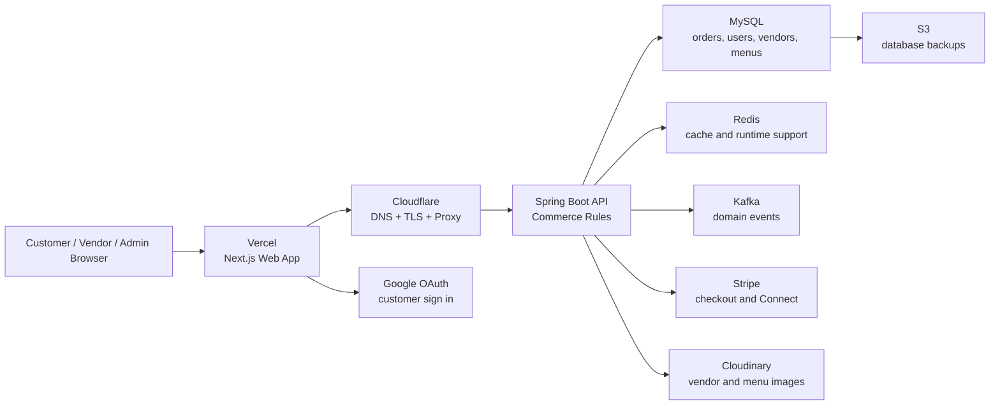
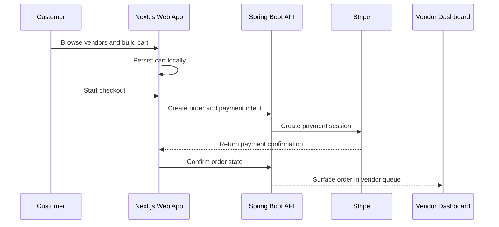

# AfroChow Marketplace Web App

AfroChow is a Canadian food marketplace focused on African restaurants, home food vendors, and customers who want familiar meals delivered with less friction.

This repository is the Next.js web app for the customer storefront, checkout experience, vendor dashboard, and admin console. It is designed as the customer facing layer of a larger commerce platform, with Stripe payments, Google sign in, persistent carts, location aware discovery, vendor operations, admin review flows, and a Spring Boot backend that owns the order and payment rules.

## Product Preview


The product is designed around three audiences:

| Audience | What they can do |
| --- | --- |
| Customers | Browse vendors, build a cart, check out, track orders, manage profile details, and return to an interrupted flow after sign in. |
| Vendors | Register their business, manage menu items, receive orders, review earnings, and complete Stripe Connect onboarding. |
| Admins | Review vendors, manage users, monitor operations, and keep marketplace data clean. |

## Why This Project Matters

AfroChow is not just a menu page. It is a commerce system with real marketplace concerns:

- Customers can browse before signing in, which keeps discovery low friction.
- The cart persists across refreshes and survives the sign in handoff.
- Payment collection is handled through Stripe, while vendor payout setup uses Stripe Connect.
- Vendor pages are built with share friendly metadata so links work well on WhatsApp, Instagram, and social previews.
- The frontend is deployed on Vercel and talks to a Spring Boot API hosted behind Cloudflare and Nginx.
- The backend uses Kafka, Redis, MySQL, Docker, scheduled backups, and event processing for work that should not block the user journey.

## Current Platform Shape

| Area | Implementation |
| --- | --- |
| Customer storefront | Public browsing, vendor discovery, cart, checkout, profile, and order tracking. |
| Vendor operations | Menu management, order queue, earnings dashboard, and Stripe Connect onboarding. |
| Admin operations | Vendor approval, customer and vendor management, and marketplace stats. |
| State management | Redux Toolkit with persisted auth and cart state, plus React Context where persistence is not needed. |
| Forms | React Hook Form with Zod schemas for reliable validation. |
| UI system | Tailwind v4, adapted shadcn style primitives, Sonner toasts, Recharts, Framer Motion, and selected Three.js hero work. |
| Deployment | Vercel frontend, Spring Boot backend at `api.afrochow.ca`, Cloudflare edge, and Docker based backend services. |

## System Design



### Checkout Flow



## Frontend Architecture

```text
src/
app/(auth)/             sign in, sign up, email verify, password reset
app/(main)/             customer routes, vendors, cart, checkout, profile
app/admin/              admin console
app/vendor/             vendor dashboard
app/onboarding/         role based onboarding
components/admin/       admin interface pieces
components/auth/        sign in and registration components
components/checkout/    cart and checkout components
components/customer/    customer profile and order views
components/home/        landing page sections
components/register/    customer and vendor onboarding
components/ui/          shared interface primitives
components/vendor/      menu editor, order queue, earnings views
contexts/               cart, theme, auth modal, and location context
hooks/                  reusable app hooks
lib/                    API client, formatters, and validation helpers
redux-store/            Redux Toolkit slices and store setup
```

## Stack

- **Next.js 16** with the App Router.
- **React 19.2** with the React Compiler.
- **Tailwind v4** with project tokens in `src/app/globals.css`.
- **Redux Toolkit** with persisted auth and cart state.
- **React Context** for theme, cart bridge, auth modal events, and location.
- **React Hook Form + Zod** for forms and validation.
- **Stripe** for checkout and vendor Connect onboarding.
- **Google OAuth** for customer sign in.
- **Framer Motion** for transitions and dashboard polish.
- **Recharts** for analytics and vendor insight views.
- **Sonner** for toasts.
- **Three.js + React Three Fiber** for the landing page hero only.

## Local Development

Prerequisites:

- Node.js 20 or later
- npm 10 or later
- A running AfroChow backend, usually `http://localhost:8080/api`

```bash
git clone git@github.com:Ibikunleogunbanwo/afrochow_frontend.git
cd afrochow_frontend
npm install
cp .env.example .env.local
npm run dev
```

The dev app runs on `http://localhost:3000`.

## Environment Variables

```bash
NEXT_PUBLIC_API_URL=http://localhost:8080/api
NEXT_PUBLIC_GOOGLE_CLIENT_ID=your_google_client_id
NEXT_PUBLIC_APP_NAME=Afrochow
NEXT_PUBLIC_APP_URL=http://localhost:3000
NEXT_PUBLIC_STRIPE_PUBLISHABLE_KEY=pk_test_value
NEXT_PUBLIC_CLOUDINARY_CLOUD_NAME=your_cloud_name
NEXT_PUBLIC_CLOUDINARY_UPLOAD_PRESET=your_upload_preset
REACT_EDITOR=code
```

Anything prefixed with `NEXT_PUBLIC_` is visible in the browser. Secrets belong on the backend.

## Useful Scripts

| Command | Purpose |
| --- | --- |
| `npm run dev` | Start the local Next.js development server. |
| `npm run build` | Create a production build. |
| `npm start` | Run the built output for parity testing. |
| `npm run lint` | Run ESLint across the repo. |

## Deployment Shape

```text
afrochow.ca       -> Vercel frontend
www.afrochow.ca   -> Vercel frontend
api.afrochow.ca   -> Spring Boot backend behind Cloudflare and Nginx
```

Vercel builds production from `main` and creates preview deployments for branches and pull requests. Environment values are managed in Vercel project settings.

## Engineering Notes

- Browsing and cart building are anonymous. Checkout is the auth gate.
- The cart persists locally, then survives the sign in handoff through `sessionStorage.returnTo`.
- API calls should go through `src/lib/api.js` or the hooks that wrap it.
- Public IDs such as `VEN`, `USR`, and `ORD` values belong in URLs. Numeric database IDs should stay server side.
- Toasts come from Sonner. Do not introduce a second toast library.
- Use `next/image` for images when possible.
- Forms should use React Hook Form with a Zod schema.

## Troubleshooting

| Symptom | First place to check |
| --- | --- |
| Sign in succeeds but returns to `/` | Confirm `sessionStorage.returnTo` is written as a raw string. |
| Stripe checkout says no API key | Check `NEXT_PUBLIC_STRIPE_PUBLISHABLE_KEY`. |
| Vendor image upload fails | Check Cloudinary cloud name and upload preset. |
| CORS error from backend | Confirm the backend includes `http://localhost:3000` or the Vercel URL in `CORS_ALLOWED_ORIGINS`. |
| Hydration mismatch | Check for timestamps, random IDs, or browser only values rendered during server render. |

## Recruiter Notes

AfroChow demonstrates full stack commerce product thinking:

- A modern Next.js storefront with vendor, customer, and admin journeys.
- Payments and vendor onboarding through Stripe and Stripe Connect.
- Persistent cart and auth return flow design.
- Social sharing and metadata awareness for vendor discovery.
- Production deployment awareness across Vercel, Cloudflare, Nginx, Docker, MySQL, Redis, Kafka, and S3 backups.
- Clear separation between user experience, commerce API contracts, and background operations.

## Contact

Ibikunle Ogunbanwo

`ibikunleogunbanwo@gmail.com`
